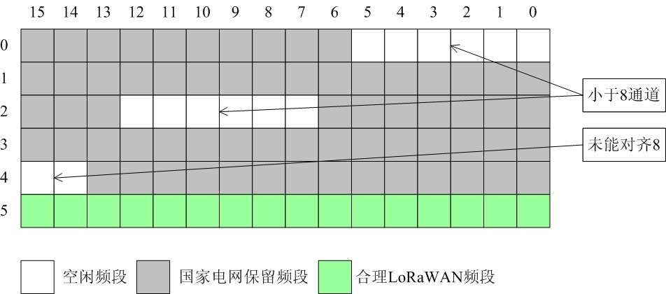

# [LoRaWAN 终端](https://github.com/OS-Q/D148)

#### 归属广域终端：[W22](https://github.com/OS-Q/W22)

#### 关于系统架构：[OS-Q](https://github.com/OS-Q/OS-Q)

Edge-Q -> 体系 Q[1,4] -> 节点 M[1,12] -> 平台 W[1,52] -> 设备 D[1,365]

### [设备描述](https://github.com/OS-Q/D148/wiki) 

LoRaWAN基于LoRa远距离通信网络设计的一套通讯协议和系统架构,按协议分层来说LoRaWAN就是MAC层,LoRa是物理层。LoRaWAN也被叫做LoRaMAC。

LoRaWAN以其明显的优势：大容量、全球统一的标准、免费频段、低成本和灵活性，和WiFi一样，成为“私有物联网”的首要选择，但更适用于低密度广域覆盖使用。

通过LoRaWAN定义协议完成自组网通信，LoRaWAN 将终端设备划分成A/B/C三类：

* Class A：双向通信终端设备。这一类的终端设备允许双向通信，每一个终端设备上行传输会伴随着两个下行接收窗口。终端设备的传输时隙是基于其自身通信需求，其微调基于ALOHA协议。
* Class B：具有预设接收时隙的双向通信终端设备。终端设备会在预设时间中开放多余的接收窗口，为了达到这一目的，终端设备会同步从网关接收一个Beacon，通过Beacon将基站与模块的时间进行同步。
* Class C：具有最大接收窗口的双向通信终端设备。这一类的终端设备持续开放接收窗口，只在传输时关闭。

### [通信频段](https://github.com/OS-Q/D148) 

按《LoRaWANRegional Parameters V1.0》标准，中国地区有2个ISM（免费）频段：

* CN779-787：最大发射功率仅10dBm(10mW)，没多大“实用”价值；
* CN470-510：最大发射功率可达17dBm(50mW)，发射时长小于5000ms即可。

中国无线电委员会，分配CN470-510是用于居民抄表应用。在“上行通信”的96个通道中（下标从0开始）：6到38，45到77，由“国家电网”保留使用。

0-5 和 39-44，这2个频段是空闲的；可惜的是，它们都只有6通道，如果使用它们，那意味着将浪费SX1301（8通道）的25%带宽。

78-79这个频段未能对齐8，实现会有麻烦（LoRaWAN协议栈，很多算法是基于8通道）。只有80-87和88-95这2个“宝贵”的频段即能对齐8，又是连续的。

### [收录资源](https://github.com/OS-Q/D148) 

* [文档](docs/)
* [资源](src/)
* [工程](LoRaWAN/)
	* [classA](LoRaWAN/classA/)
	* [classB](LoRaWAN/classB/)
	* [classC](LoRaWAN/classC/)

OS-Q中定义的其他LoRa设备：

* [LoRa-COM](https://github.com/OS-Q/D101)
* [LoRa-USB](https://github.com/OS-Q/D109)
* [LoRa-Module](https://github.com/OS-Q/D113)
* [LoRa-Router](https://github.com/OS-Q/D170)

### [OS-Q : Operation System for edge devices](http://www.OS-Q.com/Edge/D148)
####  2019-5-22
